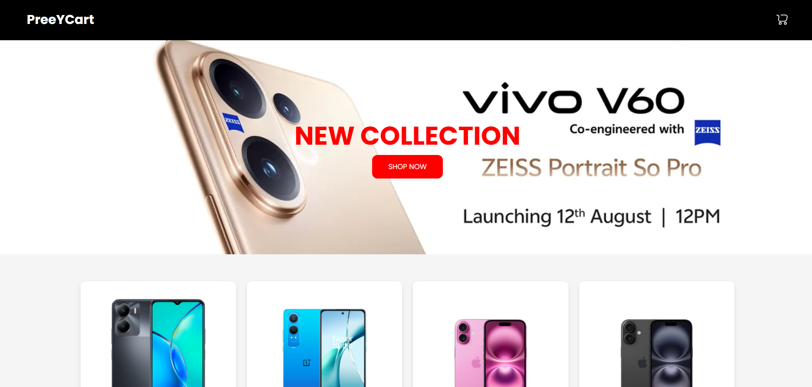

# 🛒 PreeYCart - React E-commerce Landing Page

PreeYCart is a modern and responsive **e-commerce product showcase landing page** built with **React.js** and **React Router DOM**. It features a clean user interface, sleek product cards, and a visually appealing layout perfect for mobile and desktop. Designed as a starter template for shopping websites, mobile stores, or online retailers.

> "Clean code, beautiful UI, and fast performance — everything you need to launch your next eCommerce frontend."

---

## 🚀 Features

- 🧭 Responsive navigation bar with branding
- 🖼️ Hero section with call-to-action
- 🛍️ Dynamic product listing with “Add to Cart” buttons
- 🎨 Beautiful and minimal UI using CSS-in-JS styling
- 🔻 Footer with copyright
- 🔗 Easy to customize and scale

---

## 📸 Preview



---

## 🔧 Tech Stack

| Technology       | Description                            |
|------------------|----------------------------------------|
| React.js         | JavaScript library for UI development |
| React Router DOM | Client-side routing                    |
| CSS-in-JS        | Component-level styling                |
| Google Fonts     | Poppins for modern typography          |

---

## 📁 Project Structure

```
preeycart/
├── node_modules/
├── public/
│   └── shopping-cart-svgrepo-com.svg
├── src/
│   ├── components/
│   │   ├── Navbar.jsx
│   │   ├── Hero.jsx
│   │   ├── Products.jsx
│   │   └── Footer.jsx
│   ├── App.js
│   ├── index.js
│   └── index.css
├── .gitignore
├── package.json
├── README.md
└── package-lock.json
```

---

## ⚙️ Getting Started

Follow the steps below to run the project locally:

### 1. Clone the repo

```bash
git clone https://github.com/Mahadevaprasad17/PreeYCart.git
cd PreeYCart
```

### 2. Install dependencies

```bash
npm install
```

### 3. Start the development server

```bash
npm start
```

The app will run on: `http://localhost:3000`

---

## 📦 Dependencies

```json
"react": "^18.x.x",
"react-dom": "^18.x.x",
"react-router-dom": "^6.x.x"
```

---

## 💡 Inspiration

The project draws inspiration from modern mobile e-commerce platforms and aims to help developers quickly prototype a shopping experience using React.

---

## 🙌 Contributing

Pull requests are welcome! If you'd like to improve something, feel free to fork the repo and submit a PR.

1. Fork the repo
2. Create your branch (`git checkout -b feature/YourFeature`)
3. Commit your changes (`git commit -m 'Add some feature'`)
4. Push to the branch (`git push origin feature/YourFeature`)
5. Open a Pull Request

---

## 📄 License

MIT License © 2025 [ Mahadevaprasad ]

---

## ✨ Credits

* Shopping cart icon from [SVG Repo](https://www.svgrepo.com/)
* Fonts by [Google Fonts - Poppins](https://fonts.google.com/specimen/Poppins)
* Product images from [Vivo](https://www.vivo.com), [OnePlus](https://www.oneplus.in), and [Amazon](https://www.amazon.in)

---

## 📌 GitHub Tags

`#reactjs` `#ecommerce` `#shoppingcart` `#frontend` `#reactrouter` `#webdesign` `#minimalui` `#preeYCart` `#responsive`

---

## 🧠 Learn More

* [React Documentation](https://reactjs.org/)
* [React Router DOM Docs](https://reactrouter.com/)
* [Styling and CSS-in-JS in React](https://reactjs.org/docs/faq-styling.html)
